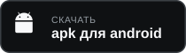

# susi connect

Сборки клиента. Здесь только файлы, без исходного кода.

## Android

Кнопка «apk для android» отдаёт файл из последнего релиза. Откройте его на телефоне — система спросит разрешение установить файл не из магазина.

Подпись та же, что у сборки в google play, поэтому обновления совместимы в обе стороны.

## Windows

Установщик появится здесь же.

## Контрольные суммы

В каждом релизе лежит `SHA256SUMS.txt`:

    sha256sum susi-connect-android.apk
